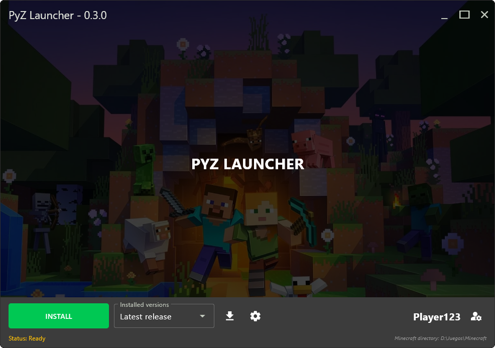

# PyZ Launcher for Minecraft



PyZ Launcher for Minecraft is an open source launcher developed with `Python`, `Flet` and `minecraft-launcher-lib` designed to simplify the installation and management of Minecraft versions.

## Roadmap

### ✅ Current Features:
- Install all **vanilla Minecraft versions** (excluding Forge / Fabric. etc).
- **Support for snapshots** to allow testing new game versions.
- Set **maximum RAM allocation**.
- Define the **Minecraft directory path**.
- Play **offline mode** without signing into Microsoft. (Upcoming authentication)

### 🔜 Upcoming Features:
- **Forge & Fabric integration** for modded gameplay.
- **Improved UI/UX enhancements** for a smoother experience.
- **Authentication with Microsoft accounts** for online gameplay.
- **Server list & multiplayer support** for easier connections.
- **Managing mods, modpacks, shaders, and texture packs** from the launcher

## Run the app

### uv

Run as a desktop app:

```
uv run flet run
```

### Poetry

Install dependencies from `pyproject.toml`:

```
poetry install
```

Run as a desktop app:

```
poetry run flet run
```

For more details on running the app, refer to the [Getting Started Guide](https://flet.dev/docs/getting-started/).

## Build the app


### macOS

```
flet build macos -v
```

For more details on building macOS package, refer to the [macOS Packaging Guide](https://flet.dev/docs/publish/macos/).

### Linux

```
flet build linux -v
```

For more details on building Linux package, refer to the [Linux Packaging Guide](https://flet.dev/docs/publish/linux/).

### Windows

```
flet build windows -v
```

For more details on building Windows package, refer to the [Windows Packaging Guide](https://flet.dev/docs/publish/windows/).
